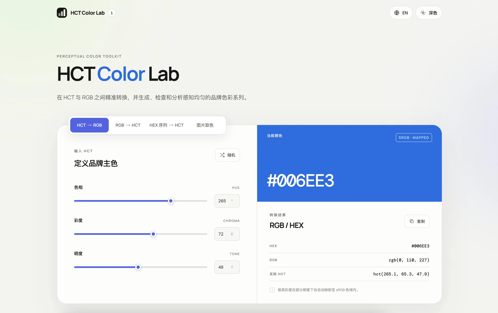
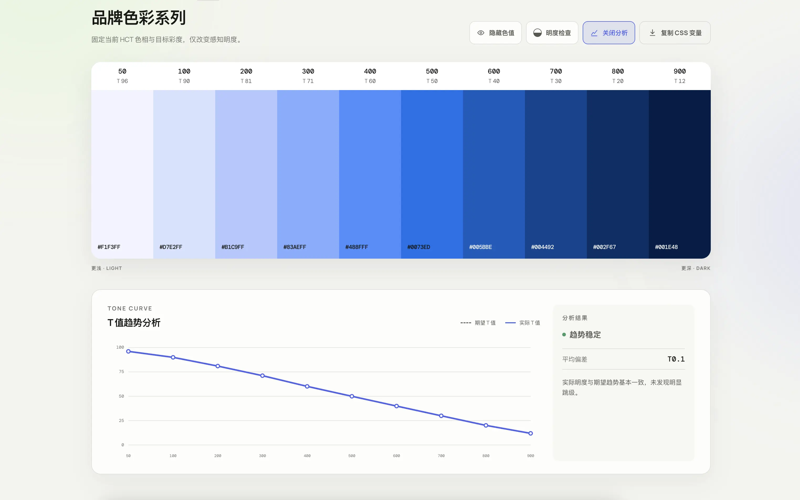

[中文](#中文) · [English](#english)

# HCT Color Lab

HCT Color Lab 是一款基于 HCT（Hue、Chroma、Tone）的品牌色彩工具，用于在 HCT、RGB 与 HEX 之间转换，并生成、检查和分析感知明度更连贯的色彩系列。

<table>
  <tr>
    <td></td>
    <td></td>
  </tr>
</table>

### 功能

- HCT 与 RGB / HEX 双向转换
- 根据品牌主色生成 10 阶色彩系列，目标 T 值为 `96、90、81、71、60、50、40、30、20、12`
- 使用多个 HEX 锚点补全 10 阶色彩系列
- 将 HEX 序列转换为对应的 HCT 色卡
- 对比期望 T 值与实际 T 值，提供节点详情和简短趋势分析
- 明度检查、隐藏色值以及 CSS 变量复制
- 从本地图片点击取色，记录并复制取色历史；图片不会上传服务器
- 中文 / English 与浅色 / 深色模式

### 本地运行

```bash
npm install
npm run dev
```

生产构建：

```bash
npm run build
```

---

# HCT Color Lab

HCT Color Lab is a brand color toolkit built around HCT — Hue, Chroma, and Tone. It converts between HCT, RGB, and HEX while helping designers generate, inspect, and analyze perceptually consistent tonal palettes.

### Features

- Bidirectional conversion between HCT and RGB / HEX
- Generate a 10-step palette from a brand color using target tones `96, 90, 81, 71, 60, 50, 40, 30, 20, 12`
- Complete a 10-step palette from multiple HEX anchor colors
- Convert an ordered HEX sequence into corresponding HCT swatches
- Compare expected and actual tone curves with node details and concise trend insights
- Grayscale tone inspection, value visibility controls, and CSS variable export
- Pick colors from a local image and copy the newest-first color history; images never leave the browser
- Chinese / English and light / dark modes

### Development

```bash
npm install
npm run dev
```

Production build:

```bash
npm run build
```

## Credits

Created by **Amsen**.

HCT conversion is powered by [Material Color Utilities](https://github.com/material-foundation/material-color-utilities).
